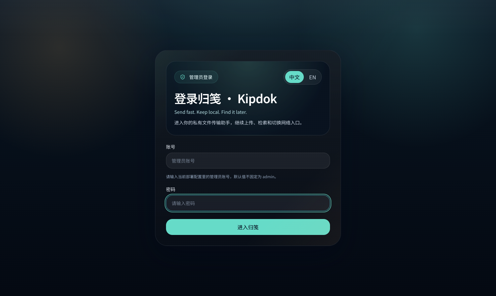
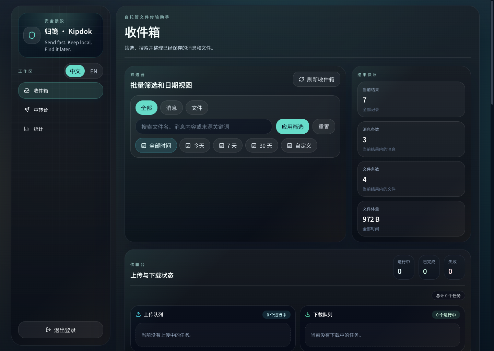
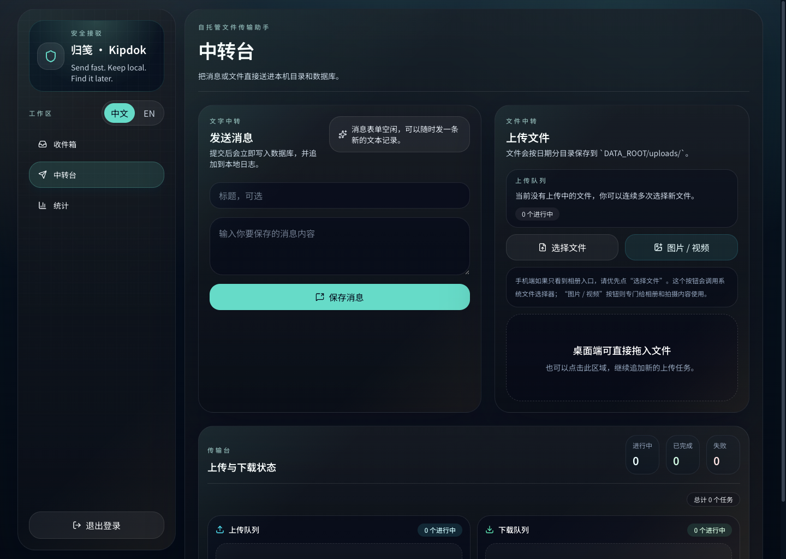
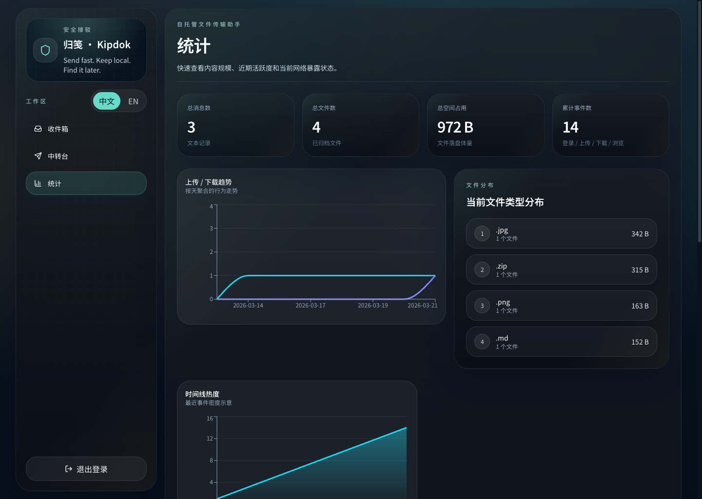

# Kipdok

> Send fast. Keep local. Find it later.

[中文说明](./README.zh-CN.md)

Kipdok is a self-hosted inbox for notes and files. It is built for people who want a fast browser-based dropbox on their own machine, with searchable history, local file storage, and basic audit trails.

It is not a cloud drive, sync client, or team document platform. The app focuses on one job: receive text and files quickly, keep them on infrastructure you control, and make them easy to find later.

## Highlights

- Browser-based note submission and file upload
- Local-first storage backed by SQLite and the filesystem
- Inbox view with search, filtering, download, and soft delete
- Transfer queue UI with per-file upload and download progress
- Dashboard views for storage, activity, and recent events
- Optional Tailscale-based access for Tailnet-only or public entry points
- Bilingual UI included in English and Simplified Chinese

## Screenshots

| Login | Inbox |
| --- | --- |
|  |  |
| Upload | Dashboard |
|  |  |

## Stack

- Next.js App Router
- React 19
- Prisma
- SQLite
- Local disk storage for uploaded files and message logs

## Quick Start

### Local development

```bash
npm install
npm run setup
npm run dev
```

Kipdok only supports one active env file in the repository root: `.env`.
Do not keep `.env.local`, `.env.production`, or other `.env*` overrides beside it.

Default sign-in URL:

```text
http://127.0.0.1:3000/kipdok/login
```

### Docker

```bash
npm run setup:env
docker compose up -d --build
```

## Environment Variables

The project ships with an [.env.example](./.env.example) template.

```env
DATABASE_URL="file:./data/db/app.db"
DATA_ROOT="./data"
SESSION_SECRET="replace-with-a-long-random-secret"
INITIAL_ADMIN_USERNAME="admin"
INITIAL_ADMIN_PASSWORD="replace-with-a-strong-password"
APP_NAME="Kipdok"
APP_BASE_URL="http://127.0.0.1:3000/kipdok"
MAX_UPLOAD_SIZE_MB="100"
```

### Required settings

- `DATABASE_URL`: database connection string
- `DATA_ROOT`: root directory for uploads, logs, exports, and the local SQLite file if used
- `SESSION_SECRET`: session signing secret
- `INITIAL_ADMIN_USERNAME`: first admin username
- `INITIAL_ADMIN_PASSWORD`: first admin password
- `APP_BASE_URL`: external base URL for the app

## Data Layout

At runtime the application writes under `DATA_ROOT`:

- `uploads/`: uploaded files grouped by date
- `messages/`: append-only message log files
- `db/`: SQLite database files when using the default local setup
- `logs/`: service logs and related runtime output
- `export/`: future export targets

Uploaded files are stored with generated filenames that combine a timestamp, a sanitized base name, and a short SHA-256 suffix. The original filename is still preserved in the database metadata.

## Running in Production

### Build and start

```bash
npm install
npm run build
npm run start -- --hostname 127.0.0.1 --port 3002
```

### Apply config changes in one command

After editing `.env`, run:

```bash
npm run apply
```

This command removes conflicting `.env*` files, normalizes `.env`, runs Prisma, rebuilds the app, and reloads the configured launchd service on `127.0.0.1:3002`.
Regular `npm run dev`, `npm run build`, and `npm run start` also refuse to run when extra `.env*` overrides are present beside `.env`.

### Initialize the database

```bash
npx prisma generate
npx prisma db push
```

### Long-running service helpers

- `npm run service:launchd:install`
- `npm run service:systemd:render`

## Network Access

Kipdok can run with or without Tailscale.

Common patterns:

- Local-only access behind a reverse proxy
- Private Tailnet access with `tailscale serve`
- Public access with `tailscale funnel`

The repository includes helper scripts for common Tailscale and service-management flows:

- [`scripts/setup-tailscale-access.sh`](./scripts/setup-tailscale-access.sh)
- [`scripts/install-launchd-service.sh`](./scripts/install-launchd-service.sh)
- [`scripts/render-systemd-unit.sh`](./scripts/render-systemd-unit.sh)
- [`scripts/network-profile.sh`](./scripts/network-profile.sh)

## Repository Scripts

- `npm run setup`: create or update local env values, install dependencies, and prepare Prisma
- `npm run setup:env`: create or update local env values only
- `npm run apply`: apply the current `.env`, rebuild, and reload the launchd service
- `npm run mock:reset`: back up the current live data, replace it with the safe mock dataset, and bring the launchd service back up
- `npm run dev`: start the development server
- `npm run build`: create a production build
- `npm run start`: run the production server
- `npm run lint`: run ESLint
- `npm run docker:up`: build and start the Docker stack
- `npm run docker:down`: stop the Docker stack

## Suitable Deployment Targets

Good fits:

- Home servers
- Small Linux VMs
- Mac mini hosts
- NAS boxes with writable local storage
- Private developer machines

Poor fits:

- Stateless serverless platforms
- Environments without persistent local disk access

## License

[MIT](./LICENSE)
